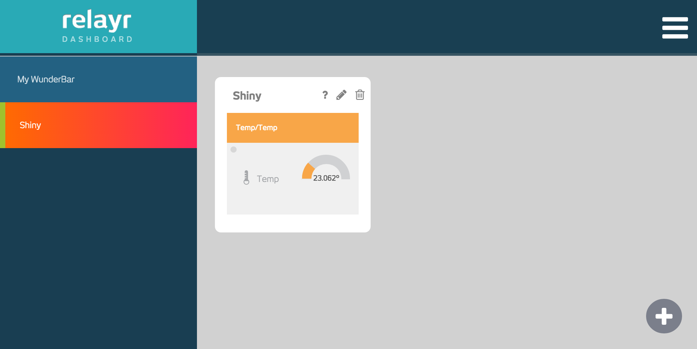

Relayr - Raspberry Pi - Demo
============================

This is a simple demo project that shows how to connect a simple
sensor attached to a `Raspberry Pi`_ to the relayr_ cloud. It uses
a digital temperature sensor, namely the very popular DS18B20_, and
two simple Python_ scripts, one to send the sensor data to the cloud,
and the other to receive it from there to be used for some other
application. The entire sample code is provided in a 
`GitHub repository`_.

Connect a sensor to the Raspberry Pi
------------------------------------

First you connect the sensor to your Raspberry Pi. You can find
a `detailed description`_ on how to connect the sensor (including a
4.7 K-Ohm resistor) like the one on the `Renewable Energy Website`_ 
in the UK. It describes how to connect the sensor (using the 1wire_
bus) with three GPIO pins (power, ground and the actual data pin).

.. figure:: picture1.jpeg
   :width: 100 %

   Temperature sensor connected to a Raspberry Pi 2 B (the USB dongle
   is for connecting to the Wifi).

After that you must ensure the 1wire communication device kernel
module is loaded. The procedure for doing that is slightly different
between Raspberry Pi versions before and after January 2015 when kernel
3.18.8 was included in Raspbian_, the most widely used Linux 
distribution for the Raspberry Pi. In the recent updates you have to
modify the file ``/boot/config.txt`` as described here:

.. code-block:: bash

    # with a pre-3.18.8 kernel:
    pi@raspberrypi ~ $ sudo modprobe w1-gpio && sudo modprobe w1_therm

    # else:
    pi@raspberrypi ~ $ uname -a
    Linux raspberrypi 3.18.11-v7+ #781 SMP PREEMPT Tue Apr 21 18:07:59 BST 2015 armv7l GNU/Linux
    pi@raspberrypi ~ $ sudo nano /boot/config.txt
    # add this line at the bottom (and then reboot):
    # dtoverlay=w1-gpio

Now you can look for respective 1wire devices in your file system. Each
DS18B20_ sensor has a unique ID that appears in this devices directory,
in our case ``28-000004a365ef``. The temperature value is accessible
under the respective path ending in ``w1_slave`` in the last line
right next to the string ``t=`` (multiplied by 1000):

.. code-block:: bash

    pi@raspberrypi ~ $ ls -l /sys/bus/w1/devices
    total 0
    lrwxrwxrwx 1 root root 0 Jun  9 17:08 28-000004a365ef -> ../../../devices/w1_bus_master1/28-000004a365ef
    lrwxrwxrwx 1 root root 0 Jun  9 17:08 w1_bus_master1 -> ../../../devices/w1_bus_master1

    pi@raspberrypi ~ $ cat /sys/bus/w1/devices/28-000004a365ef/w1_slave 
    93 01 4b 46 7f ff 0d 10 32 : crc=32 YES
    93 01 4b 46 7f ff 0d 10 32 t=25187

So the current temperature is 25.187 degrees Celsius! The next section
shows how to read this information in a more reusable way so it
can be communicated easily elsewhere.

Read the sensor data
--------------------

Once you know the unique ID of your DS18B20_, you can access the
sensor data in a more reusable way with a Python function like this:

.. code-block:: python

    def read_temperature(device_id):
        "Read float temperature value from 1wire device DS18B20_."
        with open('/sys/bus/w1/devices/%s/w1_slave' % device_id) as f:
            text = f.read().strip()
            fragments = text.split()
            return float(fragments[-1][2:]) / 1000.

You can test this by writing a short loop to read and display the
temperature while you try to change the ambiant temperature around
the sensor:

.. code-block:: python

    >>> import time
    >>> while True:
    ...     print(read_temperature('28-000004a365ef'))
    ...     time.sleep(1)
    ... 
    25.312
    25.312
    25.375
    25.75
    26.937
    28.75
    30.437
    29.875
    26.562
    25.875

Now that the sensor is working and delivers data it's time to push
that data into the relayr cloud as shown in the next section.

Create a device prototype in the relayr dashboard
-------------------------------------------------

If you don't have a `relayr developer`_ account, please create one,
first. Once you have an account, you create a sensor prototype simply
by going on your `relayr devices page`_ and moving your mouse pointer
on the big plus button in the lower right corner. In the pop-up
menu which then shows up you click on "Add prototype".

On the next page you create a `relayr device prototype`_ by first
entering a name for your device. Clicking on "Add prototype" then 
will show a page with some credentials which you should save as they
are necessary for connecting your sensor, later. These credentials
come as a JSON dictionary like this (don't use those shown here, as
they are made up):

.. code-block:: python

    {
      "user":     "565738d3-29ef-442d-b055-debb1a1be13c",
      "password": "442SsprjRXbY",
      "clientId": "TVlc51xjvQxywVd67GhvhPA",
      "topic":    "/v1/565738d3-29ef-442d-b055-debb1a1be13c/"
    } 

Publish your sensor data into the relayr cloud
----------------------------------------------

You can publish your data using MQTT_ (a protocol for communicating
messages from machine to machine) which needs to be installed on
your Raspberry Pi if not available, yet. The ``paho-mqtt`` package
provides MQTT support for Python and can be easily installed as a 
Python package with ``pip`` like this (install ``pip`` first if you
don't have it, yet):

.. code-block:: bash

    pi@raspberrypi ~ $ sudo apt-get install python-pip
    pi@raspberrypi ~ $ sudo pip install paho-mqtt==1.1

You have successfully installed it if you can run this statement in
Python without any error: ``import paho``.

Then you copy the sample Python snippet from the dashboard prototype
page that you've seen when creating a prototype. The `GitHub repository`_
contains a file named ``publish_data.py`` which is a slightly expanded
version of that code snippet from the dashboard. If you start it on your
Raspberry Pi (first make sure, you use your own credentials!) it will run
in an endless loop, reading temperature values and publishing them one
per second to the relayr cloud.

Watch your sensor data on the relayr dashboard
----------------------------------------------

As you push your data into the relayr cloud you can see the live values
as they change in the relayr dashboard_. In the following screenshot the
device prototype was named Shiny:

   Widget showing temperature of your device prototype in the relayr
   dashboard.

Fetch your sensor data from the relayr cloud
--------------------------------------------

Watching your data in the dashboard as it changes is great, but at some
moment you'll want to fetch it for really doing something with it. For
that purpose you can access your data via MQTT again by writing a simple
script like the one named ``fetch_data_mqtt.py`` in the `GitHub repository`_.
If you just run that script it will show the live MQTT messages containing
the data values as received:

.. code-block:: bash

    pi@raspberrypi ~ $ python fetch_data_mqtt.py
    Connecting to mqtt server.
    Connected.
    Message received: {"meaning": "temperature", "value": 25.187}
    Message received: {"meaning": "temperature", "value": 25.187}
    Message received: {"meaning": "temperature", "value": 25.187}
    Message received: {"meaning": "temperature", "value": 25.562}
    Message received: {"meaning": "temperature", "value": 25.75}
    Message received: {"meaning": "temperature", "value": 25.937}
    Message received: {"meaning": "temperature", "value": 25.875}
    ^C^C

If you use one of the relayr SDKs like the `Python SDK`_ this will become
even more convenient, reducing the sample code to access your data
by more than half. The `GitHub repository`_ contains a script named
``fetch_data_sdk.py`` to show how to do that. If you are on a fresh
Raspberry Pi, make sure you update its Debian package list and install
some developer packages, before installing the newest relayr package
from GitHub like this:

.. code-block:: bash

   pi@raspberrypi ~ $ sudo apt-get update
   pi@raspberrypi ~ $ sudo apt-get install python-dev libffi-dev libssl-dev
   pi@raspberrypi ~ $ pip install git+https://github.com/relayr/python-sdk

Wrap-Up
-------

In this simple demo project you've seen how you can easily connect a
simple temperature sensor to a `Raspberry Pi`_ and publish its data
from there into the relayr_ cloud. There you can see it displayed live
in a widget on your relayr dashboard, or with just a few lines of code
you can fetch your data from the relayr cloud to be used in some
application. You can use MQTT to publish and receive the sensor data,
or one of the relayr SDKs, like the `Python SDK`_, for fetching the data
more conveniently.

Surely, you can use more exciting sensors and also publish
data values more complex than a single float, e.g. a list of three
floats representing some geospatial information. Whenever you provide
a *reading* known to the relayr dashboard it will show your data in
a nice widget. And you can also publish something even more involved,
like an object with deeper nesting levels. In that case the dashboard
will show a generic widget. It's up to you and your use case. The source
code on GitHub for the file ``publish_data.py`` has some commented lines
of code to give you directions of how to do that.

.. _MQTT: http://mqtt.org
.. _GitHub repository: https://github.com/relayr/relayr-raspberry-pi
.. _DS18B20: http://www.maximintegrated.com/en/products/analog/sensors-and-sensor-interface/DS18B20.html
.. _detailed description: http://www.reuk.co.uk/DS18B20-Temperature-Sensor-with-Raspberry-Pi.htm
.. _Renewable Energy Website: http://www.reuk.co.uk
.. _1wire: https://en.wikipedia.org/wiki/1-Wire
.. _Raspberry Pi: https://www.raspberrypi.org
.. _Python SDK: https://github.com/relayr/python-sdk
.. _Python: https://www.python.org
.. _relayr: https://relayr.io
.. _relayr developer: https://developer.relayr.io
.. _dashboard: https://developer.relayr.io/dashboard/
.. _relayr devices page: https://developer.relayr.io/dashboard/devices
.. _relayr device prototype: https://developer.relayr.io/dashboard/prototype
.. _Raspbian: https://www.raspbian.org
